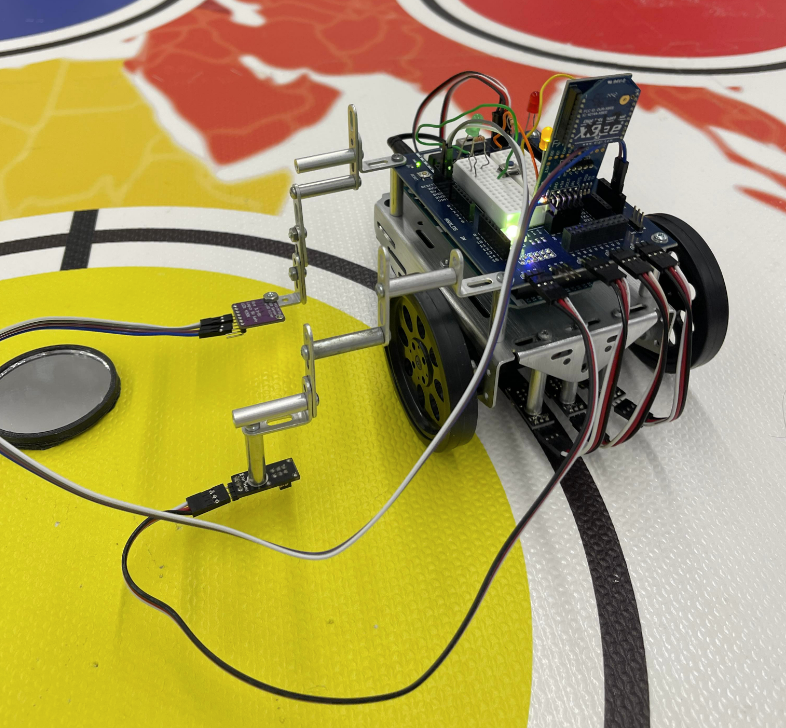

# Mirror-sensing Boe-Bot
The code implements functions that lets the BOE-bot perform the following functions: 
1. following a dark path using **QTI** sensors
2. detecting presence of mirrors using a **QTI** sensor
3. detecting the color of the surface where it stand using a **ColorPAL** sensor
4. transmits signals to and receive from other BOE-bots using the **XBee Communications Module**

*Taken during a demonstration of the fully-functional boe-bot*

